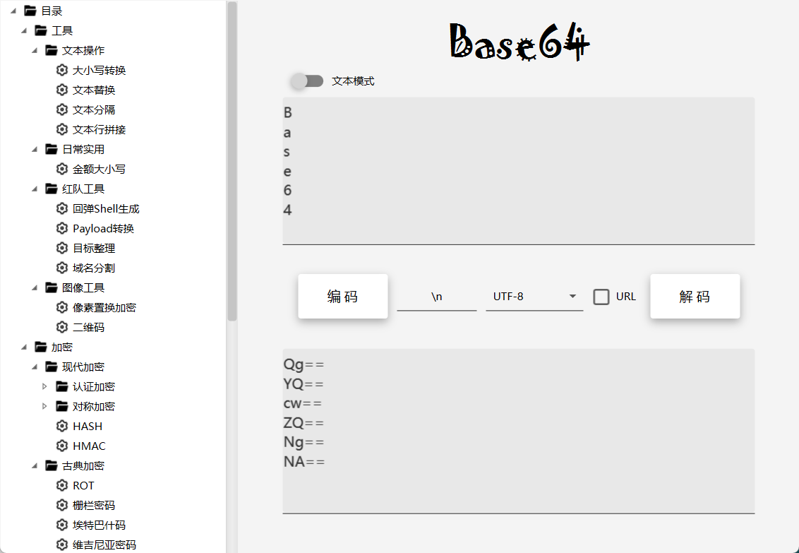

    

<a href="README.md">English</a> | <a href="README-zh.md">中文</a>

## 简介

一个CTF+渗透测试工具包，主要实现一些常用的加密与编码功能，在软件使用过程中发现问题或建议欢迎提交 issue,也欢迎提交新功能需求。

前身为[CryptionTool](https://github.com/ffffffff0x/CryptionTool)，为更方便的开发更换框架重构。

软件基于JDK17开发，使用JAVAFX UI框架以及JFoenixUI组件架构。详见开发文档。

名称中的 **Beryl**`(['berəl])` 是一种宝石/矿物的名字，**Enigma** `([ɪ'nɪɡmə])`有谜团的意思，也指代一种密码机。

---

# 界面展示

    
    
    
    

## 下载
访问 [releases](https://github.com/ffffffff0x/BerylEnigma/releases) 下载

**MAC 用户请放置在应用程序路径下以加载bcprov的加解密包**

**一些旧版本的macOS可能无法运行**

## 打包
1. 在电脑上安装并配置好 JDK17 以及 Maven 环境
2. 克隆仓库
3. 运行 `jpackage` 目录下的对应系统的打包脚本
4. 打包完的软件文件夹存放在 `target` 目录下

---

# 目前支持的功能

**加解密/编解码**
- 现代
  - 认证
    - HTLM-hash
    - JWT
  - 对称加密
    - 块加密
  - hash
  - HMAC
- 古典
  - ROT13
  - 栅栏密码
  - Atbash
  - Vigenre
  - 凯撒密码
- 编码
  - URL
  - ASCII
  - BaseEncoding
    - Base64
    - Base16
    - Base32
    - Base58
    - Base62
    - Base85
    - Base91
    - Base92
  - BrainFuck
  - HEX
  - HTML实体编码
  - Unicode
  - 摩斯电码
  - 数学进制转换

**文本操作工具**
- 文本替换
- 文本分隔
- 英文大小写转换
- 文本行拼接

**红队用工具**
- 目标整理
- 域名分割
- 回弹shell生成
- Payload转换

**日常实用工具**
- 货币金额大小写

**图像工具**
- 像素置换加密
- 二维码生成与解码

## 待办清单
- 日常实用 - Unix时间戳
- 红队工具 - 目标生成
- 红队工具 - 字典生成
- UI - 输入字符数量
- 代码 - 全局事件
- 功能 - 历史记录
- 功能 - 选择语言 (目前是自动的)
---

# 免责声明

本项目所有文件仅供学习和研究使用,请勿使用项目中的文件用于非法用途,任何人造成的任何负面影响,与本人无关.

# Special Thanks
Special thanks to [JetBrains](https://www.jetbrains.com) for their support to this project.

