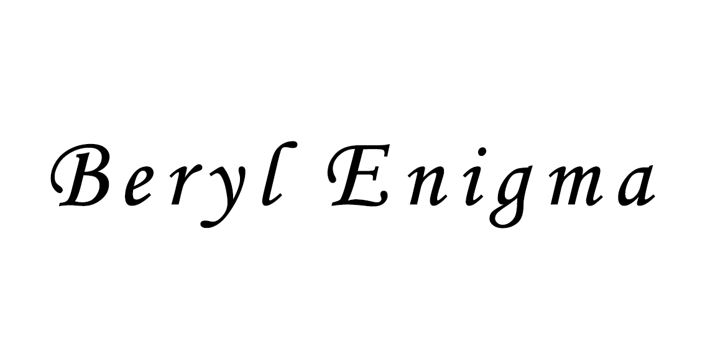
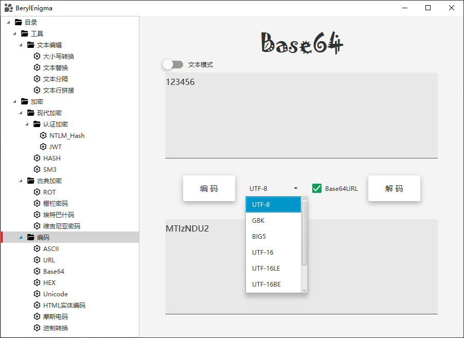

    

## 简介

一个CTF+渗透测试工具包，主要实现功能在加解密和编码这块，在软件使用过程中发现问题或建议欢迎提交 issue,也欢迎提交新功能需求。

前身为[CryptionTool](https://github.com/ffffffff0x/CryptionTool)，为更方便的开发更换框架重构。

软件基于JDK16开发，使用JAVAFX UI框架以及JFoenixUI组件架构。详见开发文档。

名称中的 **Beryl**`(['berəl])` 是一种宝石/矿物的名字，**Enigma** `([ɪ'nɪɡmə])`有谜团的意思，也泛指二战中的一种密码机。

---

# 界面展示

## 下载
访问 [releases](https://github.com/ffffffff0x/BerylEnigma/releases) 下载

---

# 目前支持的功能

**加解密/编解码**
- 现代
  - 认证
    - HTLM-hash
    - JWT
  - hash
  - SM3
- 古典
  - ROT13
  - 栅栏密码
  - Atbash
  - Vigenre
  - 凯撒密码
- 编码
  - URL
  - ASCII
  - Base64
  - HEX
  - HTML实体编码
  - Unicode
  - 摩斯电码
  - 数学进制转换

**文本操作工具**
- 文本替换
- 文本分隔
- 英文大小写转换
- 文本行拼接

**红队用工具**
- 目标整理
- 域名分割

**日常实用工具**
- 货币金额大小写

## 待办清单
- 现代加密 - AES,DES
- 现代加密 - SM2,SM4
- 现代加密 - HMAC
- 编码 - XOR
- 编码 - URL编码增强
- 文本操作 - 文本去重
- 日常实用 - Unix时间戳
- 红队工具 - 目标生成
- 红队工具 - 字典生成
- UI - 弹出式设置框
- UI - 输入字符数量
- 代码 - 全局事件
- 功能 - 历史记录
- 功能 - 输出覆盖填充输入
- 功能 - 选择语言
---

# 免责声明

本项目所有文件仅供学习和研究使用,请勿使用项目中的文件用于非法用途,任何人造成的任何负面影响,与本人无关.