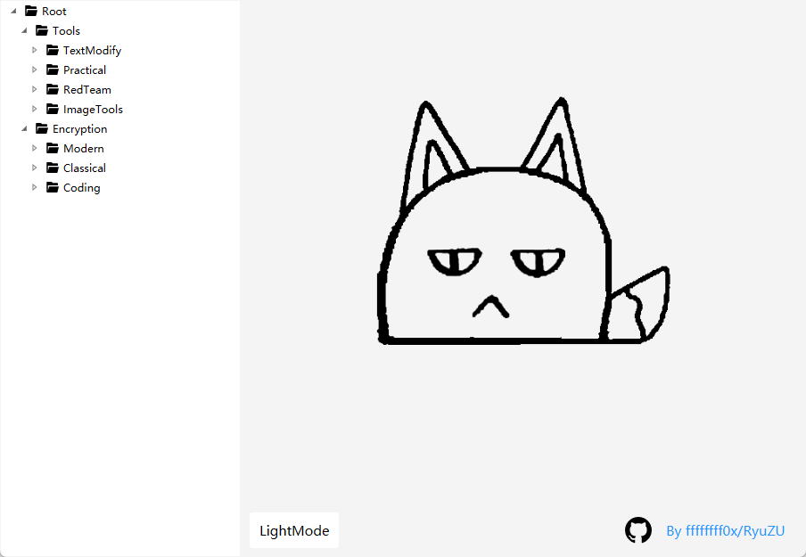
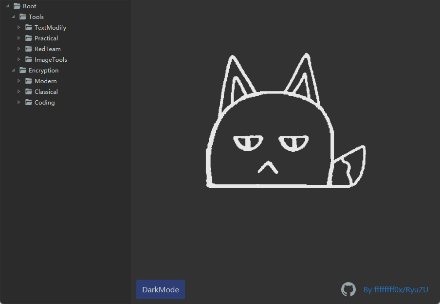
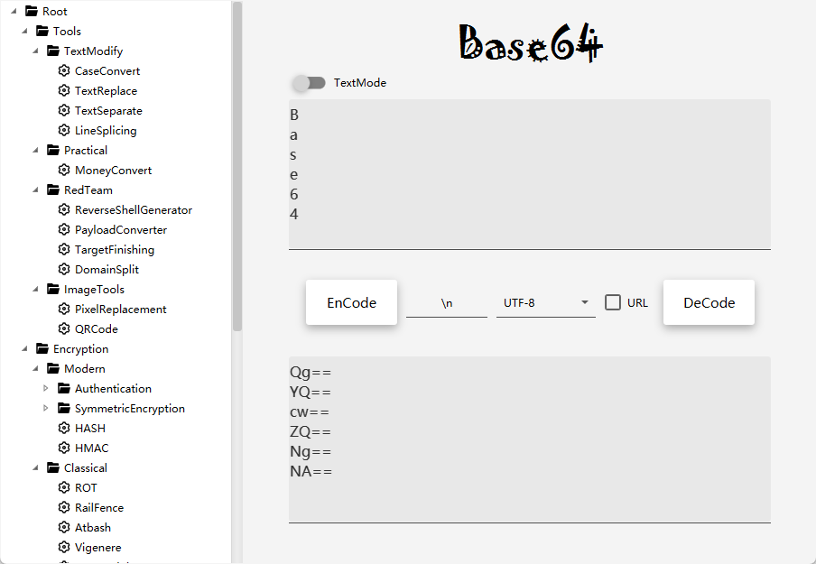
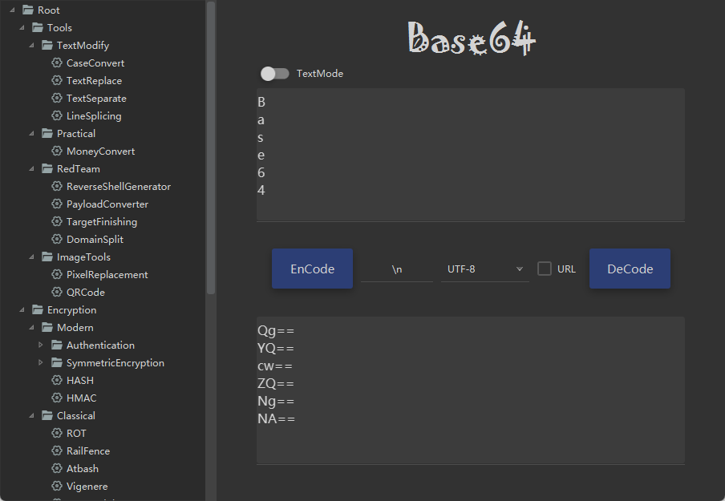

    

<a href="README.md">English</a> | <a href="README-zh.md">中文</a>

## Description

A CTF + penetration testing toolkit, mainly to achieve some common encryption and coding functions, in the process of using the software found problems or suggestions are welcome to submit issues and also welcome to submit new feature requirements.

Software is developed based on JDK17, using the JAVAFX UI framework and the JFoenixUI component architecture. See the development documentation for details.

The **Beryl** `(['berəl])` in the name is the name of a gem/mineral and **Enigma** `([ɪ'nɪɡmə])` has the meaning of an enigma and also refers to a cipher machine.

---

# View

    
    
    
    

# Download
Visit [releases](https://github.com/ffffffff0x/BerylEnigma/releases) 

**MAC users should place it in the application path to load bcprov's package**

**Some older versions of macOS may not work**

# Package
1. Install and configure JDK17 and Maven environment on your computer
2. Clone ffffffff0x/BerylEnigma project
3. Run the packaging script for the corresponding system in the `jpackage` directory
4. The packaged software folder is stored in the `target` directory

---

# Function

**Encryption/Decoding**
- Modern
  - Authentication
    - HTLM-hash
    - JWT
  - SymmetricCipher
    - BlockCipher
  - hash
  - HMAC
- Classical
  - ROT13
  - FenceCode
  - Atbash
  - Vigenre
  - CaesarCode
- Coding
  - URL
  - ASCII
  - BaseEncoding
    - Base64
    - Base16
    - Base32
    - Base58
    - Base62
    - Base85
    - Base91
    - Base92
  - BrainFuck
  - HEX
  - HTML entity encoding
  - Unicode
  - MorseCode
  - Mathematical binary conversion

**TextModify**
- TextReplace
- TextSeparate
- CaseConvert
- LineSplicing

**RedTeam**
- TargetFinishing
- DomainSplit
- ReverseShellGenerator
- PayloadConverter

**Practical**
- MoneyConvert(chinese)

**ImageTools**
- PixelReplacement
- QRCode

## To-Do List
- Practical - UnixTimeStamp
- RedTeam - Target Generation
- RedTeam - Dictionary Generation
- UI - Number of input characters
- Code - Global Events
- Function - History
- Function - Select Language (now is auto)
---

# Disclaimers

All files in this project are for study and research purposes only, please do not use the files in the project for illegal purposes, and any negative impact caused by anyone is not my responsibility.

# Special Thanks
Special thanks to [JetBrains](https://www.jetbrains.com) for their support to this project.

